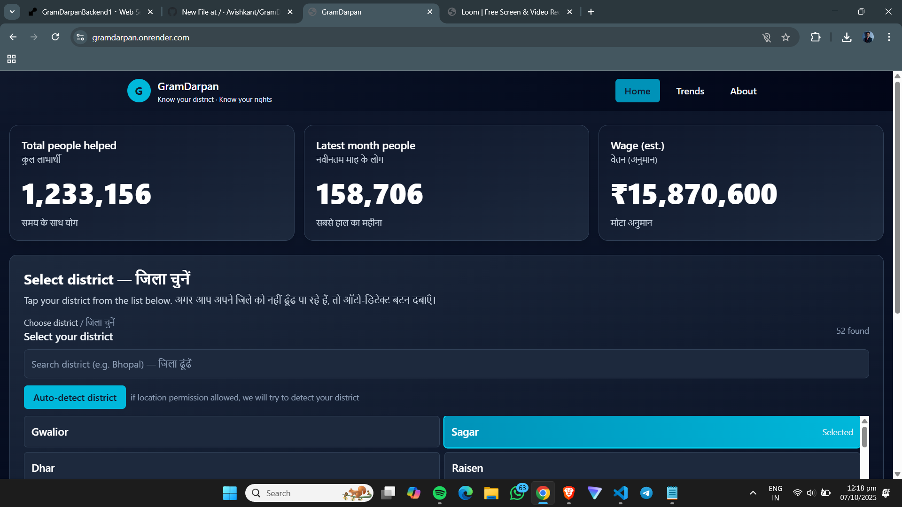
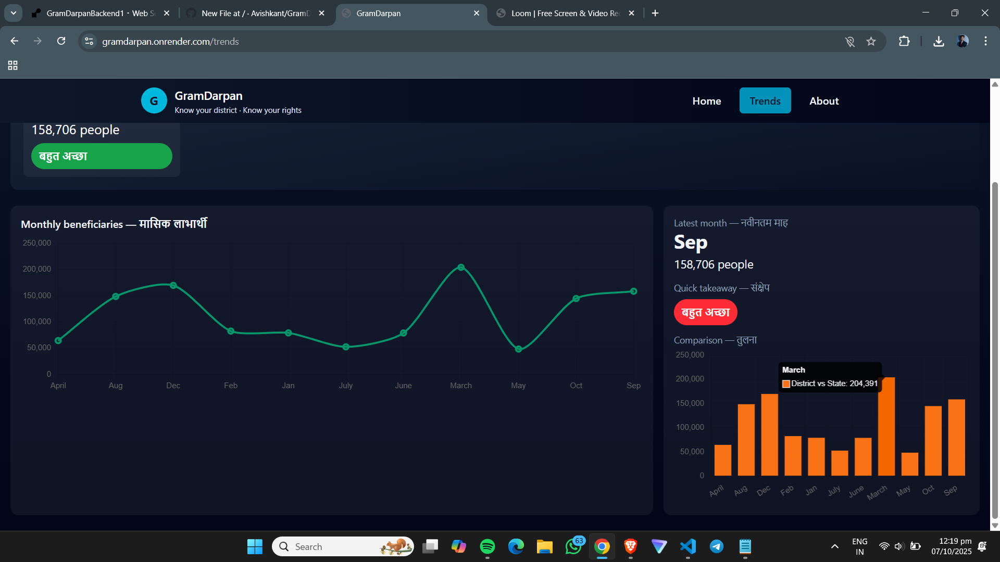

# GramDarpan — Our Voice, Our Rights

Live demo: https://gramdarpan.onrender.com

Short description
-----------------
GramDarpan is a simple, accessible web app that lets citizens view the monthly performance of their district under MGNREGA (Mahatma Gandhi National Rural Employment Guarantee Act). The site focuses on clarity and usability for low-literacy users: large text, icons, bilingual labels, and simple color cues.

Screenshots
-----------
Main UI (home / district selector):







What it does (user-facing)
--------------------------
- Let users select their district or use browser geolocation (opt-in) to auto-detect.
- Show current-month KPIs with simple color/icon cues and short captions.
- Provide month-by-month trends and a plain comparison to state/district averages.
- Low‑literacy focused UI: large labels, icons + color, short sentences, bilingual support (Hindi/English). Audio readout is planned.

Key technical decisions
-----------------------
- Backend ETL: periodic worker fetches monthly data from the government Open API and precomputes compact time-series to avoid rate limits and downtime from data.gov.in.
- Storage: MongoDB is used to store compact, precomputed time-series (per-district monthly rows).
- Caching: short in-process TTL cache for very fast reads; optional Redis support for cross-instance caching.
- Rate limiting and optional express-rate-limit are supported to protect upstream APIs and the service under load.

Run locally (development)
-------------------------
Prerequisites: Node.js and npm installed.

1. Start the backend

```powershell
cd backend
npm ci
node index.js
```

2. Start the client (dev server with proxy)

```powershell
cd client
npm ci
npm run dev
```

The Vite dev server proxies `/api` to the backend (see `client/vite.config.js`). In development, the client `.env` intentionally leaves `VITE_API_BASE` empty so dev proxy is used.

Build for production
--------------------
To build the client and serve it from the backend in a single deploy:

```powershell
cd client
npm ci
npm run build
cd ../backend
npm ci
node index.js
```

Deployment notes (Render example)
--------------------------------
If you deploy to Render (or a VM), use these settings for the backend service:

- Branch: `working-local-2025-10-06` (or `main` after merge)
- Build command:
  cd client && npm ci && npm run build; cd ../backend && npm ci
- Start command:
  cd backend && node index.js
- Environment variables: set these in the Render dashboard (never commit secrets to the repo)

Required environment variables (examples)
---------------------------------------
- MONGO_URL — MongoDB connection string (Atlas recommended)
- DB_NAME — e.g. GramDarpan
- DATA_GOV_BASE — https://api.data.gov.in/resource
- DATA_GOV_API_KEY — your data.gov API key
- BACKEND_URL — public backend URL (https://your-api.example)
- CLIENT_URL — public client URL (https://your-site.example)
- ADMIN_TOKEN — a secret token for admin actions
- NOMINATIM_USER_AGENT — contact/email for geocoding usage

Health checks
-------------
The backend exposes a health endpoint at `/api/health`. Example:

```powershell
curl https://gramdarpan.onrender.com/api/health
```

Performance & scaling
---------------------
- The API precomputes monthly reports and stores compact series in Mongo — this reduces calls to the upstream data.gov API and keeps latency low.
- For large-scale traffic: run multiple backend instances behind a load balancer, and enable Redis as a shared cache (set `REDIS_URL`).
- Apply rate limiting on user‑facing and upstream‑calling routes.

Accessibility & low‑literacy UX notes
----------------------------------
- Large fonts, pictograms and color+icon semantics for each KPI.
- Bilingual labels (English + Hindi) with short captions.
- Reduced cognitive load: show only 3–4 top-level KPIs on the dashboard. The Trends page uses plain charts with clear legends.

Repo & branches
----------------
- Branch with the latest working UI (from local session): `working-local-2025-10-06`
- Default branch: `copilot/vscode1759658098781` (development history in the repo)


Next steps / enhancements
-------------------------
- Add on‑device audio readouts for numbers and charts.
- Pre-generate and store district summaries in a compact collection to make reads O(1).
- Add a small admin endpoint to invalidate caches post-ETL.


Live site: https://gramdarpan.onrender.com

